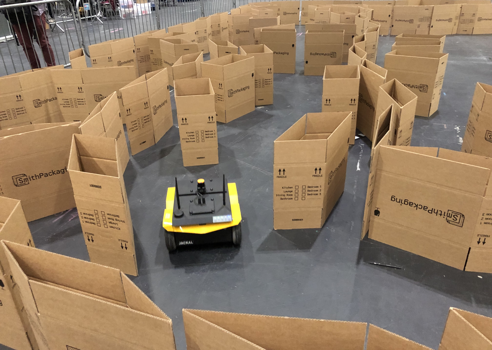

# INVENTEC BARN Challenge 2023 - Real-world

<p align="center">
  
</p>

## Overview

This repository is the actual-code employed by INVENTEC Team during the BARN Challenge 2023, UK, London. In this approach, we try to extend the best-performing baseline of Learning from Learned Hallucination (*LfLH*() with improved collision check and recovery behaviors via finite-state machines (FSM).

## Obejctive
The aim of this project is to solve the [The BARN challenge 2023 in ICRA Competition](https://cs.gmu.edu/~xiao/Research/BARN_Challenge/BARN_Challenge23.html). The competition uses a [Jackal robot](https://clearpathrobotics.com/jackal-small-unmanned-ground-vehicle/) from Clearpath Robotics to navigate in unknown and highly constrained spaces.


---
## Installation
First, follow the [instruction](https://www.clearpathrobotics.com/assets/guides/noetic/jackal/network.html) to setup Jackal-robot's network connection. Then, follow the instructions below to install all dependecies packages in the Jackal robot to run this approach.

### 1. System Packages

```
sudo apt install -y build-essential python3-pip git
```

### 2. Python Packages
   
```
pip3 install --upgrade pip
pip3 install defusedxml rospkg netifaces numpy empy torch torch-vision scipy scikit-build pillow tensorboard setuptools==59.5.0 matplotlib tqdm pyautogui opencv-python==4.6.0.66
```

### 3. Create ROS workspace

```
mkdir -p /<YOUR_HOME_DIR>/inventec_ws/src
cd /<YOUR_HOME_DIR>/jackal_ws/src
```

### 4. Clone this repo

```
mkdir 
git clone -b real-world https://github.com/inventec-ai-center/inventec-team-barn-challenge-2023.git
```

### 5. Install ROS package dependencies

```
cd ..
source /opt/ros/noetic/setup.bash
rosdep init; rosdep update
rosdep install -y --from-paths . --ignore-src --rosdistro=noetic
```

### 6. Build the workspace

```
catkin_make
source devel/setup.bash
```

---

## Running the code
Follow the instructions below to run the code in the Jackal robot.
After positioned the robot on the starting point, reset robot odometry:
```
rosservice call /jackal/reset_odometry
```

Then, run the code.
```
roslaunch lflh barn_icra_2023.launch
```

--- 

## Copyright
CITE our technical report.
```
@article{mandala2023barn,
  title={The BARN Challenge 2023--Autonomous Navigation in Highly Constrained Spaces--Inventec Team},
  author={Mandala, Hanjaya and Christmann, Guilherme},
  journal={arXiv preprint arXiv:2307.14580},
  year={2023}
}
```

Also, reference to original author.
```
@inproceedings{wang2021agile,
  title={From agile ground to aerial navigation: Learning from learned hallucination},
  author={Wang, Zizhao and Xiao, Xuesu and Nettekoven, Alexander J and Umasankar, Kadhiravan and Singh, Anika and Bommakanti, Sriram and Topcu, Ufuk and Stone, Peter},
  booktitle={2021 IEEE/RSJ International Conference on Intelligent Robots and Systems (IROS)},
  pages={148--153},
  year={2021},
  organization={IEEE}
}
```